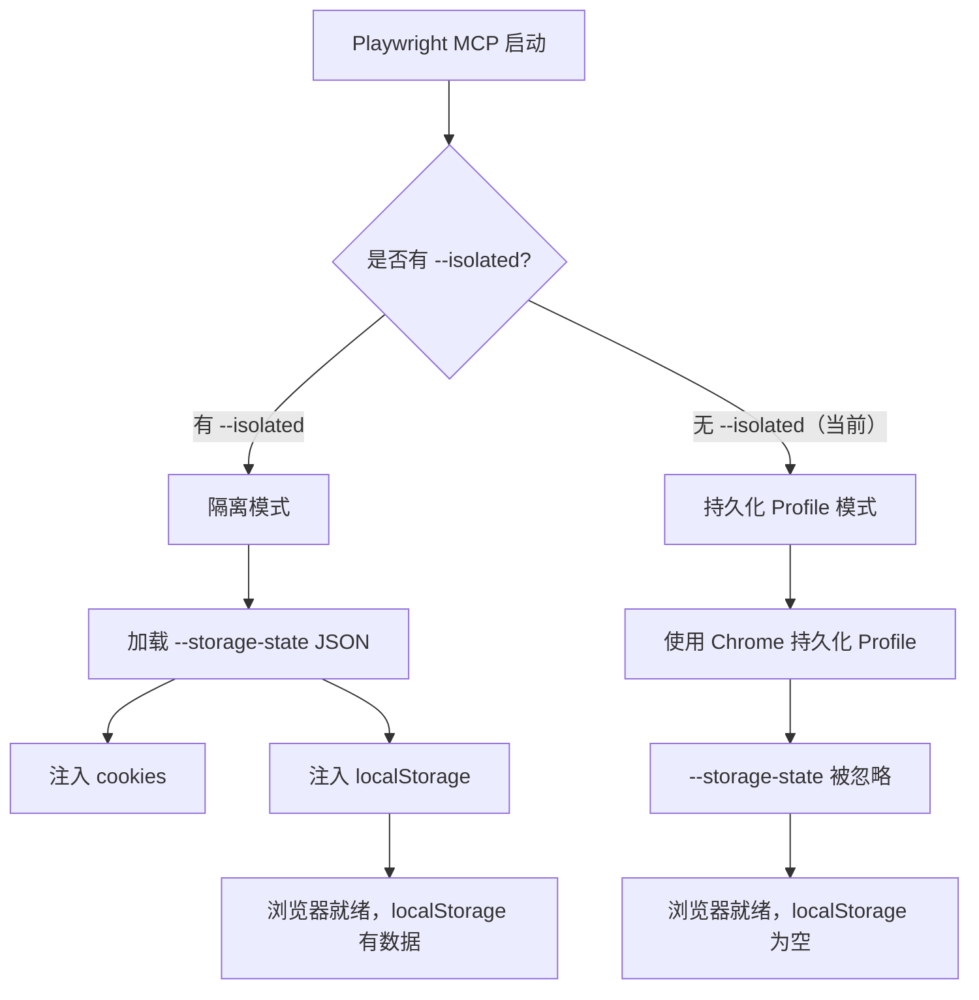

# localStorage / 登录态未注入：根因分析与修复方案

## 问题现象

终端日志 7.txt 第 384-390 行显示：

- 页面提示 **"API Key 未配置，请前往设置页面配置"**
- claude-coder Agent 确认 `playwright-auth.json` 中有有效的 `llm_config`，但浏览器的 localStorage 为空
- Agent 不得不用 `browser_evaluate` 手动注入 localStorage 后才能继续测试

## 根因定位：**项目配置问题**（非 Playwright MCP bug，非 claude-coder bug）

### 直接原因

[`.mcp.json`](.mcp.json) 配置如下：

```json
{
  "mcpServers": {
    "playwright": {
      "command": "npx",
      "args": [
        "@playwright/mcp@latest",
        "--storage-state=.claude-coder\\playwright-auth.json"
      ]
    }
  }
}
```

**缺少 `--isolated` 标志。**

### 技术解释

根据 Playwright MCP 官方文档（[README.md](https://github.com/microsoft/playwright-mcp)），`--storage-state` 的定义是：

> `--storage-state`: path to the storage state file **for isolated sessions**.

Playwright MCP 有两种运行模式：



- **持久化 Profile 模式**（默认，当前配置）：浏览器使用 `%USERPROFILE%\AppData\Local\ms-playwright\mcp-chrome-profile` 目录。`--storage-state` 参数**被忽略**，localStorage 不会被注入。
- **隔离模式**（需要 `--isolated`）：每次会话都在全新的隔离上下文中启动，`--storage-state` 文件中的 cookies 和 localStorage **才会被正确加载**。

### 证据链

1. Playwright MCP README 明确示例将 `--isolated` 和 `--storage-state` 配对使用
2. `--storage-state` 描述精确写了 "for isolated sessions"
3. Issue [#21](https://github.com/microsoft/playwright-mcp/issues/21) 中 maintainer Pavel Feldman 确认：默认模式使用 "dedicated Chrome profile"，而非 storage state 文件
4. 终端日志中 Agent 自己也确认了 "playwright-auth.json 中有有效的 llm_config，但浏览器似乎没有正确注入"

### 排除的可能性

- **不是 Playwright MCP 的 bug**：这是 by design 的行为，文档明确说明 `--storage-state` 仅适用于 isolated sessions
- **不是 claude-coder 工具的 bug**：claude-coder 正确生成了 `playwright-auth.json` 和 `.mcp.json`，但配置模板缺少 `--isolated`
- **不是 `playwright-auth.json` 格式问题**：JSON 格式和内容完全正确，符合 Playwright storageState 规范

## 修复方案

### 修复 1：在 `.mcp.json` 中添加 `--isolated` 标志

```json
{
  "mcpServers": {
    "playwright": {
      "command": "npx",
      "args": [
        "@playwright/mcp@latest",
        "--isolated",
        "--storage-state=.claude-coder\\playwright-auth.json"
      ]
    }
  }
}
```

### 修复 2：同步更新 `playwright-testing-guide.md` 中的配置模板

[`.claude-coder/playwright-testing-guide.md`](.claude-coder/playwright-testing-guide.md) 第 436-445 行的模板也缺少 `--isolated`，需要同步修正。

### 修复 3：更新 `.claude/CLAUDE.md` 的 MCP 文档

明确注明 `--storage-state` 需要配合 `--isolated` 使用。

### 副作用评估

添加 `--isolated` 后的行为变化：

- 每次 MCP 会话都会启动**全新的隔离浏览器上下文**（之前是复用持久化 Chrome Profile）
- 浏览器关闭后所有状态丢失（但这正是测试场景需要的——可重复性）
- `playwright-auth.json` 中的 localStorage 会在每次会话开始时正确注入
- 不会影响用户日常 Chrome 浏览器的 profile