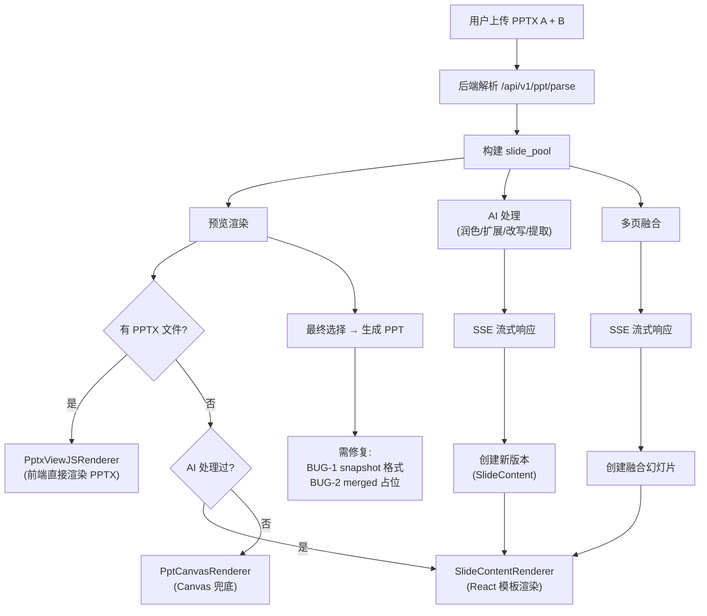

# PPT 渲染方案调研与代码复审

## 背景

当前项目 `/merge` 页面有三个核心问题：

1. PPT 预览依赖后端 LibreOffice 转图片，无 LibreOffice 时 Canvas 兜底效果极差（仅灰色色块+截断标题）
2. AI 合并/润色后，产出的结构化内容（`SlideContent`）无法渲染为美观的页面
3. AI 合并流程存在多处 BUG，数据格式不一致导致端到端不通

---

## 文档一：前端解析 PPT 通过 Canvas 渲染的调研方案

### 现状分析

项目中已存在三套前端渲染方案，但均未在 merge 页面正式使用：

| 方案 | 文件 | 状态 |

|------|------|------|

| `PptCanvasRenderer` | `ppt-canvas-renderer.tsx` | **正在使用**，但为"简化渲染"模式，只画标题+灰色占位块 |

| `PptxjsRenderer` | `pptxjs-renderer.tsx` | 未使用，JSZip 自研解析，只支持第一页 |

| `PptxViewJSRenderer` | `pptxviewjs-renderer.tsx` | 未使用，已安装 `pptxviewjs ^1.1.4` |

### 业界方案调研

**方案 A：pptxviewjs（推荐，项目已安装）**

- 开源 MIT，Canvas 渲染，支持文本/图片/表格/图表/SVG/合并单元格
- 项目已安装 `pptxviewjs ^1.1.4` + `chart.js ^4.5.1`
- 已有封装组件 `PptxViewJSRenderer`，但事件名和 API 参数需核实
- 用法：传入 PPTX 文件的 `ArrayBuffer`，直接渲染到 Canvas
- 优势：零后端依赖，教学场景（简单布局）完全够用
- 问题：已有代码中事件监听名 `loaded` 可能需改为 `loadComplete`

**方案 B：pptx-preview（HTML 渲染）**

- npm 周下载 8.3K，纯前端，HTML DOM 渲染（非 Canvas）
- 支持动画、图表（ECharts）、移动端
- 用法：`init(container, {width, height}).preview(arrayBuffer)`
- 优势：HTML 渲染可定制 CSS，交互性更好
- 劣势：非开源核心代码，依赖 echarts/lodash 体积较大

**方案 C：@kandiforge/pptx-renderer（React Canvas）**

- React 专用，Canvas 渲染，性能 <50ms/页
- 支持主题色/字体解析，高 DPI
- 劣势：商业授权

### 推荐

- **主方案**：pptxviewjs（已安装，只需修复已有组件 + 接入 merge 页面）
- **降级方案**：保留现有 `PptCanvasRenderer`，优化简化渲染为详细渲染

### 改造要点

1. 修复 `PptxViewJSRenderer` 事件名和 API 调用
2. 在 merge 页面，当有 PPTX 文件时，优先用 `PptxViewJSRenderer` 渲染原始文件
3. AI 处理后的新版本无 PPTX 文件，降级到优化后的 `PptCanvasRenderer`
4. 优化 `PptCanvasRenderer`：修复颜色格式、段落对齐、图片渲染

---

## 文档二：AI 产出内容后的美观渲染方案

### 核心问题

AI 返回的是结构化 JSON（`SlideContent`），当前渲染效果：

- `contentToPageData` 将所有 `main_points` 堆叠在一个 text_box 中
- Canvas 渲染只有黑色文字+灰色背景，无设计感
- 无字体变化、无配色、无布局模板

### AI 返回数据结构

```typescript
// 单页处理(polish/expand/rewrite/extract)
{ title: string, main_points: string[], additional_content?: string }

// 多页融合(partial)
{ title: string, elements: [{type, content}], ... }
```

### 方案对比

**方案 A：React 组件渲染（Tailwind + Framer Motion）-- 推荐**

- 将 AI 内容用 React 组件 + Tailwind CSS 渲染为美观的"幻灯片卡片"
- 预定义 5-8 套布局模板（标题页、内容页、列表页、对比页、总结页）
- 根据 `teaching_role` 或 `action` 自动选择模板
- 可选加入 Framer Motion 进场动画
- 优势：完全可控、与项目技术栈一致（Next.js + Tailwind）
- 实现：新建 `SlideContentRenderer` 组件，替代 Canvas 渲染 AI 内容
```
AI JSON → 模板匹配（by action/role）→ React 组件渲染 → 美观幻灯片卡片
```


**方案 B：Reveal.js React 嵌入**

- 使用 reveal.js 的 React 封装渲染单页
- 支持 Markdown 内容、代码高亮、数学公式
- 劣势：Reveal.js 设计为全屏演示，嵌入预览面板需大量定制

**方案 C：Markdown → HTML 渲染**

- AI 返回内容转 Markdown，用 `react-markdown` + 自定义主题渲染
- 简单但排版控制有限，不适合幻灯片卡片式展示

### 推荐方案：React 组件模板渲染

架构设计：

```
SlideContent (AI JSON)
    ↓
TemplateSelector (根据 action/role 选模板)
    ↓
SlideTemplate (React 组件)
    ├── TitleSlideTemplate      — 大标题 + 副标题
    ├── ContentSlideTemplate    — 标题 + 要点列表
    ├── CompareSlideTemplate    — 左右对比布局
    ├── KnowledgeSlideTemplate  — 知识点卡片 (extract)
    └── SummarySlideTemplate    — 总结页
    ↓
Tailwind CSS 美化 + 可选 Framer Motion 动画
```

### 设计规范

- **配色方案**：教学蓝 (#3B82F6) 为主色，配辅助色（绿、橙、紫）
- **字体层级**：标题 28px bold / 副标题 20px / 正文 16px / 注释 14px
- **间距**：卡片内 padding 24px，元素间 gap 16px
- **圆角**：卡片 12px，内部元素 8px
- **动画**：入场 fadeIn + slideUp，元素依次出现（stagger 100ms）

---

## 文档三：代码流程复审

### 一、严重 BUG

#### BUG-1：`_add_slide_from_snapshot` 与 `content_snapshot` 格式不兼容

- **位置**：[`ppt_generator.py:524-573`](backend/app/services/ppt_generator.py)
- **问题**：`_add_slide_from_snapshot` 期望 `{title, main_points, elements}` 顶层结构
- AI 返回的 `content_snapshot` 实际为 `{action, polished_content: {title, main_points}}` 嵌套结构
- **结果**：v2+ 版本生成最终 PPT 时，title/main_points 全部为空
- **修复**：在 `_add_slide_from_snapshot` 开头调用已有的 `_extract_content_from_snapshot` 方法

#### BUG-2：融合幻灯片（merged_N）在 `generate-final` 中为占位实现

- **位置**：`backend/app/api/ppt.py` 约 2679-2693 行
- **问题**：对 `merged_N` 类型，直接取 ppt_a 第一页，完全未使用融合内容
- **代码**：有 `TODO: 后续需要存储融合幻灯片的独立内容` 注释
- **修复**：需要将融合结果的 `content` 传递到 `_add_slide_from_snapshot`

#### BUG-3：`local_` 会话无法生成最终 PPT

- **位置**：[`useMergeSession.ts:256`](frontend/src/hooks/useMergeSession.ts)
- **问题**：后端会话创建失败时使用 `session_id = local_${Date.now()}`
- 调用 `generate-final` 时后端返回 404「会话不存在」
- **修复**：失败时应阻止进入 merge 步骤，或在生成时走纯前端路径

#### BUG-4：`processSlide` SSE 异常吞噬

- **位置**：[`useMergeSession.ts:422-424`](frontend/src/hooks/useMergeSession.ts)
- **问题**：`catch (e) { }` 空 catch 吞噬 JSON 解析异常
- 若 SSE 数据格式异常（如后端返回非 JSON），用户看不到任何错误
- 当 `event.stage === 'error'` 时抛出的异常被外层 try-catch 捕获，但空 catch 会在此之前吞噬错误

### 二、中等问题

#### ISSUE-5：颜色格式错误

- **位置**：[`ppt-canvas-preview.tsx:184`](frontend/src/components/ppt-canvas-preview.tsx)
- `color: '000000'` 缺少 `#` 前缀，Canvas 无法正确解析
- 应为 `color: '#000000'`

#### ISSUE-6：convert-to-images URL 路径错误

- **位置**：`backend/app/services/ppt_to_image.py`
- `session_id = self.output_dir.name` → `"versions"`
- 生成 URL：`/public/versions/versions/{filename}.png`（多了一层 versions）
- 且 `/public` 挂载的是 `public/` 目录，而文件实际存储在 `uploads/versions/`

#### ISSUE-7：FinalSelectionBar 未使用 `version.preview_url`

- **位置**：[`final-selection-bar.tsx`](frontend/src/components/final-selection-bar.tsx)
- 仅使用 `slideImageUrls[slide_id]`，但 page.tsx 未传入 `slideImageUrls`
- 即使 AI 版本有 preview_url，最终选择栏也不显示

#### ISSUE-8：段落居中/右对齐逻辑错误

- **位置**：[`ppt-canvas-renderer.tsx:357-378`](frontend/src/components/ppt-canvas-renderer.tsx)
- 多 run 段落中，每个 run 单独累加 `currentX`
- 居中/右对齐时应先计算整段总宽度再定位起始点

### 三、代码重复与冗余

| 问题 | 位置 | 说明 |

|------|------|------|

| 三套渲染组件 | `ppt-canvas-renderer`, `pptxjs-renderer`, `pptxviewjs-renderer` | 三套方案共存但只用了一套的简化模式 |

| 重复导入 | `ppt.py:2-3` | `StarletteUploadFile` 重复导入两次 |

| `versionToPageData` 重复定义 | `slide-pool-panel.tsx:56` 和 `slide-preview-panel.tsx:114` | 两处独立实现 `SlideVersion → EnhancedPptPageData` 转换 |

| `getSourceLabel` 重复 | `slide-pool-panel.tsx`, `slide-preview-panel.tsx`, `page.tsx` | 多处定义相同的来源标签函数 |

| `ppt_content_parser._extract_teaching_content` | `backend/app/services/ppt_content_parser.py:409` | 死代码，实际使用 `semantic_extractor` |

### 四、实现第二点（AI 内容美观渲染）的代码改造清单

1. **新建 `SlideContentRenderer` 组件**

   - 替代 `contentToPageData` + `PptCanvasRenderer` 的 AI 内容渲染
   - 接收 `SlideContent` + `action` 类型，自动选择模板

2. **修改 `SlidePreviewPanel`**

   - 当 `version.action` 存在时（AI 处理过的版本），使用 `SlideContentRenderer`
   - 原始版本仍用 `PptxViewJSRenderer`（有 PPTX 文件时）或 `PptCanvasRenderer`

3. **修改 `SlidePoolPanel` 缩略图**

   - AI 版本缩略图也用 `SlideContentRenderer` 的缩略模式

4. **修改 `FinalSelectionBar`**

   - 统一使用 `SlideContentRenderer`

5. **统一数据转换**

   - 将 `versionToPageData` / `contentToPageData` 提取到 `lib/slide-utils.ts`

6. **修复 BUG-1 ~ BUG-4**

   - 确保端到端流程可用
