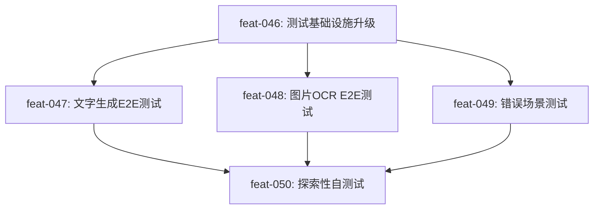

# 测试与架构复审方案

## 一、PPT 生成：前端 vs 后端

### 调研结论

| 维度 | 前端 PptxGenJS | 后端 python-pptx + OOXML |

|------|----------------|--------------------------|

| 动画/过渡 | 不支持（官方明确列为 unimplemented，Issue #823 已关闭） | 支持（通过 OOXML 后处理注入 CT_Transition、CT_Animate） |

| 点击交互 | 不支持 | 可通过 OOXML timing/trigger 实现 |

| 拼音标注 | 无 pypinyin 等价库 | pypinyin 成熟可用 |

| 颜色高亮/形状 | 基础支持 | 完整 OOXML 操作 |

| 服务器负载 | 零（客户端生成） | 中（LLM + PPT 生成） |

| 离线使用 | 可离线下载 | 需联网 |

### 结论

**后端生成是唯一正确选择**。PptxGenJS 明确不支持动画和过渡效果，而项目的核心差异化价值（OOXML 动画、点击显示答案、互动选择题）全部依赖后端 OOXML 操作。

前端生成只适合"纯文字、无动画、无交互"的极简 PPT，这不符合项目定位。当前架构无需改变。

---

## 二、当前测试问题诊断

### 问题 1: 测试只"看"不"用"

当前 AI agent 的 Playwright MCP 测试行为：

```
browser_navigate → browser_snapshot → browser_console_messages → "通过"
```

实际应该的测试行为：

```
browser_navigate → browser_fill(文本框) → browser_click(生成按钮) → 
等待SSE完成 → browser_snapshot(验证结果) → browser_click(下载) → "通过"
```

**根本原因**: tasks.json 中的步骤描述不够具体，AI agent 选择了"最小阻力路径"——用 curl 和代码审查代替浏览器交互。

### 问题 2: Playwright 测试文件不带凭证

[frontend/playwright.config.ts](frontend/playwright.config.ts) 第 14-32 行：`use` 配置中**没有** `storageState`，因此运行 `pnpm exec playwright test` 时，测试不会注入 `llm_config` 到 localStorage。

而 [.mcp.json](.mcp.json) 通过 `--storage-state=.claude-coder\playwright-auth.json` 配置了 Playwright MCP 的凭证注入。这意味着：

- Playwright MCP（AI agent 用）: 有 API Key
- Playwright Test Runner（脚本测试）: 没有 API Key

但从终端日志来看，**即使 Playwright MCP 携带了 API Key，AI agent 也从未实际触发生成流程**——它只做了页面快照和控制台检查。

### 问题 3: 生成按钮"无法点击"的真实原因

[upload/page.tsx](frontend/src/app/upload/page.tsx) 第 663-665 行：

```typescript
disabled={isGenerating || !textContent && imageFiles.length === 0 && !pdfFile}
```

生成按钮的 disabled 条件**不检查 API Key**，只检查是否有内容输入。因此：

- 有文本内容 + 有 API Key = 可以生成
- 有文本内容 + 无 API Key = 可以点击，但会显示错误提示
- 无内容 = 按钮灰色

用户说"无法点击生成"，可能是因为在文本模式下没有输入内容，或在图片/PDF模式下但实际 textContent 为空。

---

## 三、如何引导 AI Agent 自测试

### 核心方法论：Prescriptive Task + Seed Pattern + Assertion Gate

根据 Playwright 官方 2026 年发布的 Test Agents 架构（Planner → Generator → Healer），以及 Currents.dev 的 9 条策略，关键点是：

**1. 任务步骤必须写成"可执行的动作序列"，而非"描述性需求"**

坏的步骤写法（当前）：

```
"测试完整 PPT 生成流程：上传文本内容 -> 配置参数 -> 点击生成 -> 等待 SSE 推送"
```

好的步骤写法（改进后）：

```
"使用 Playwright MCP browser_navigate 访问 http://localhost:3000/upload"
"使用 browser_fill 在文本框输入测试内容：'三角形的面积公式...'"
"使用 browser_select 选择年级=小学五年级、学科=数学"
"使用 browser_click 点击生成教学PPT按钮"
"等待 30 秒，使用 browser_snapshot 验证页面出现PPT预览区域"
"如果页面显示错误提示，将错误内容记录到 record/test_issues.md"
"如果成功，使用 browser_click 点击下载PPT按钮，确认下载链接有效"
```

**2. 创建 Seed Test 文件，让 AI agent 学习测试模式**

在项目中创建 `.claude-coder/test-seed.md`，包含：

- Playwright MCP 工具的正确调用方式
- 一个完整的"输入→生成→验证"测试流程示例
- 断言规则（什么算通过、什么算失败）

**3. 验证步骤必须是"只有浏览器交互才能完成"的**

坏的验证：`grep -q '问题描述' record/playwright_test_v1.md`

好的验证：`使用 browser_snapshot 确认页面包含"下载 PPT"按钮且 href 指向有效文件`

---

## 四、具体任务设计

### feat-046: Playwright 测试基础设施升级

修复测试凭证链路，确保 AI agent 和脚本测试都能携带 API Key。

**关键改动**:

- [frontend/playwright.config.ts](frontend/playwright.config.ts): `use` 中增加 `storageState` 指向 `playwright-auth.json`
- 创建 `.claude-coder/test-seed.md`: 编写完整的 Playwright MCP 测试模板
- 创建 `frontend/tests/fixtures.ts`: 封装带认证的测试上下文

### feat-047: 文字输入完整生成流程端到端测试

**步骤设计**（每一步都是 Playwright MCP 动作，不允许用 curl 替代）:

1. `browser_navigate` 到 `/upload`
2. `browser_snapshot` 确认页面加载完成
3. `browser_fill` 在文本框输入数学测试内容（至少 100 字）
4. `browser_select` 选择"小学五年级" + "数学" + "简约清晰"
5. `browser_click` 点击"生成教学PPT"按钮
6. 每 5 秒执行 `browser_snapshot`，观察 SSE 进度变化，最多等 120 秒
7. 验证：页面出现"PPT 预览"区域且有可翻页的缩略图
8. `browser_click` 点击"下载 PPT"按钮
9. 记录生成耗时、页数、是否有错误
10. **如果失败**: 截图 + 控制台消息 + 错误文本，记录到 `record/e2e_test_results.md`
11. **如果成功**: 使用 curl 下载 PPT 文件，验证文件大小 > 0

### feat-048: 图片上传 OCR 流程端到端测试

1. 准备测试图片（`record/test_image.png`，包含数学公式截图）
2. `browser_navigate` 到 `/upload`
3. `browser_click` 切换到"图片上传"模式
4. `browser_upload_file` 上传测试图片
5. 验证：页面显示已选择的图片文件名
6. 配置参数后 `browser_click` 生成
7. 验证：OCR 提取 → 文本填充 → SSE 生成 → 预览展示完整链路

### feat-049: 错误场景与边界条件测试

1. **无 API Key 测试**: 清除 localStorage，点击生成，验证错误提示文案
2. **空内容测试**: 不输入内容，验证生成按钮是 disabled 状态
3. **超长内容测试**: 输入 5000+ 字内容，验证是否正常处理
4. **无效 API Key**: 设置假 Key，点击生成，验证错误处理
5. 每个场景都使用 `browser_snapshot` 截图 + `browser_console_messages` 检查

### feat-050: AI Agent 自主探索性测试

这是"引导AI自发现问题"的关键任务。设计思路：**不告诉 agent 预期结果，而是让它像真实用户一样操作，自己判断什么是问题**。

步骤设计：

1. "你是一位第一次使用 AI 教学PPT生成器的教师。使用 Playwright MCP 完成以下任务："
2. "任务 A: 为你的小学三年级数学课（三角形面积）生成一份 PPT"
3. "任务 B: 为你的初中英语课（Unit 5 Past Tense）生成一份 PPT"
4. "任务 C: 检查历史记录页面是否能看到刚才生成的记录"
5. "任务 D: 修改 LLM 服务商设置，切换模型，再生成一份PPT"
6. "在整个过程中，记录每一个让你感到困惑、受阻或不满的点"
7. "将发现的问题写入 record/exploratory_test.md，格式：问题描述/复现步骤/截图/严重程度"
8. "针对每个问题，分析代码根因并提出修复方案"

---

## 五、test-seed.md 模板设计

创建 `.claude-coder/test-seed.md`，内容包括：

```markdown
# Playwright MCP 测试模板

## 规则
1. 必须使用 Playwright MCP 工具（browser_navigate, browser_fill, browser_click, 
   browser_snapshot, browser_console_messages）进行测试
2. 禁止用 curl 或代码审查替代浏览器交互测试
3. 每个测试动作后必须 browser_snapshot 验证结果
4. localStorage 中已预置 llm_config（含 API Key），无需手动配置

## 标准测试流程
1. browser_navigate → http://localhost:3000/upload
2. browser_snapshot → 确认页面加载
3. browser_fill → 在 ref="textbox" 的文本框输入教学内容
4. browser_select → 选择年级、学科、风格
5. browser_click → 点击"生成教学 PPT"按钮
6. 循环 browser_snapshot（每5秒）→ 观察进度条/结果
7. browser_click → 点击"下载 PPT"
8. 记录结果到 record/e2e_test_results.md

## 断言标准
- 通过：页面出现"PPT 预览"区域 且 出现"下载 PPT"按钮
- 失败：页面出现红色错误提示 或 30秒内无响应变化
```

---

## 六、任务依赖关系



feat-046 是基础（修复凭证链路），feat-047/048/049 是具体测试场景，feat-050 是最终的"AI自主探索"测试。