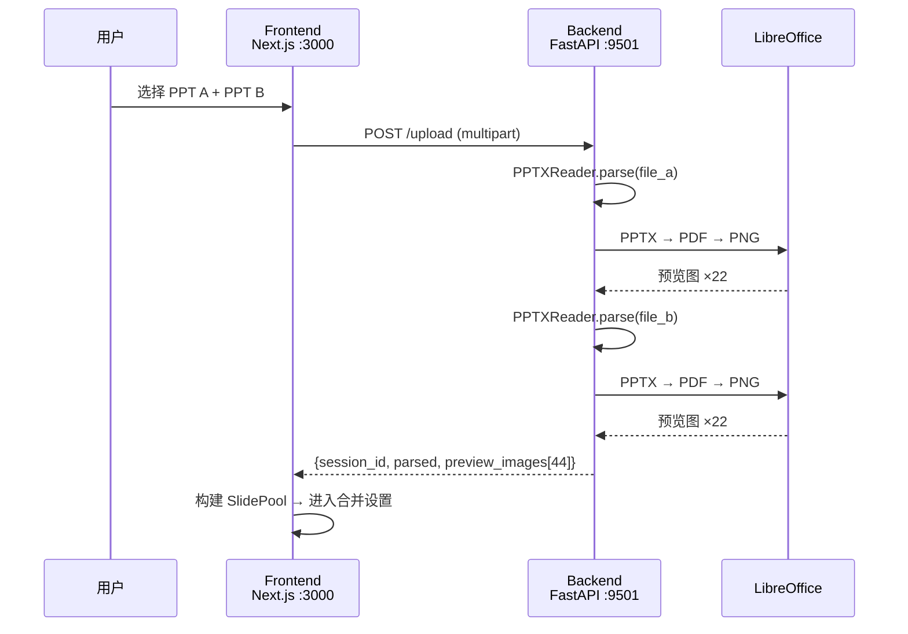
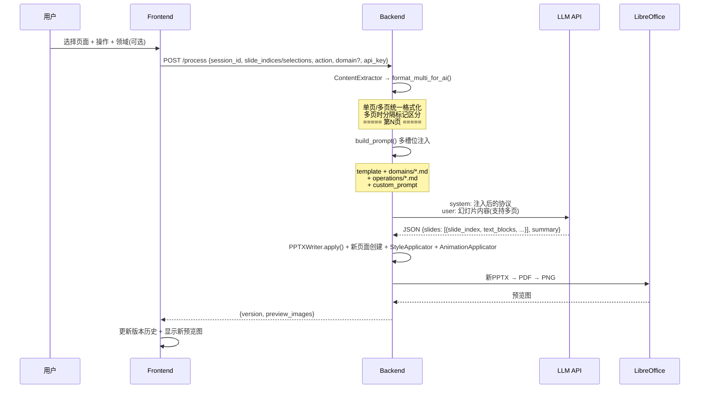
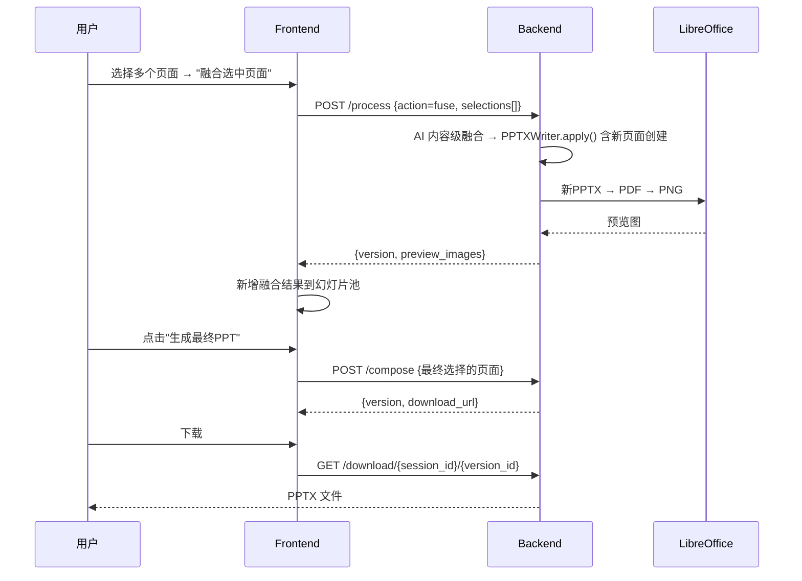

# AI 教学 PPT 生成器 — 项目架构文档

> 本文件是项目的完整技术地图。任何 AI 或开发者读完本文档即可理解架构、代码组成、功能和交互。

---

## 一、项目概述

**目标**：上传 PPTX → 浏览器预览 → AI 润色/改写/扩展/提取/融合 → 保留原始格式导出 PPTX

**核心原则**：**非破坏性增量修改** — 系统自动保留原始格式（字体、颜色、动画、图片、布局），AI 可修改文本内容，并可选地建议样式和动画调整。支持学科/年级维度的领域注入。AI 处理后生成 **Clean Output PPTX**（仅含结果页面），不携带未处理的原始页面。

**技术栈**：
- 前端：Next.js 15 + React 18 + TailwindCSS + shadcn/ui + pnpm
- 后端：Python FastAPI + python-pptx + OpenAI 兼容 LLM
- 预览图：LibreOffice (headless) + PyMuPDF (PDF→PNG)
- 测试：Playwright MCP（浏览器自动化）

**提示词架构**：多槽位注入（领域 × 操作 × 自定义），详见第八节。

---

## 二、数据流架构

### 2.1 上传与解析流程



### 2.2 AI 处理流程



### 2.3 页面组合与导出流程



---

## 三、目录结构

```
ai-teaching-ppt/
├── PROJECT.md                    ← 本文件：项目架构全貌
├── README.md                     ← 项目简介和运行说明
├── requirements.md               ← 用户需求文档（只读）
├── .gitignore
│
├── docs/
│   ├── technical-spec.md         ← 技术规格：数据模型、API、模块边界
│   └── refactor-plan.md          ← 重构计划和执行状态
│
├── logs/                         ← 运行时会话日志（gitignored）
│
├── backend/                      ← Python 后端
│   ├── requirements.txt          ← Python 依赖
│   ├── Dockerfile                ← 容器构建
│   ├── .env                      ← 本地环境变量（API密钥等）
│   │
│   ├── app/
│   │   ├── main.py               ← FastAPI 入口：CORS、路由注册、静态文件挂载
│   │   ├── config.py             ← Settings：端口(9501)、路径、LLM默认值
│   │   │
│   │   ├── core/                 ← 核心 PPT 处理管道
│   │   │   ├── models.py         ← 四层数据模型 + StyleHints + AnimationHint
│   │   │   ├── pptx_reader.py    ← PPTX → ParsedPresentation
│   │   │   ├── content_extractor.py ← ParsedPresentation → SlideContent（AI友好）
│   │   │   ├── pptx_writer.py    ← 修改指令 → 写回PPTX（集成插件）
│   │   │   ├── style_applicator.py  ← 可插拔：应用样式提示(bold/color/size)
│   │   │   ├── animation_applicator.py ← 可插拔：应用动画提示(fade/fly_in)
│   │   │   └── session_logger.py ← 会话级文件日志
│   │   │
│   │   ├── ai/                   ← AI 处理层
│   │   │   ├── prompt_template.md ← AI协议文档（通用PPT格式协议）
│   │   │   ├── prompts.py        ← 多槽位注入引擎（加载 domains/ + operations/）
│   │   │   ├── processor.py      ← AIProcessor：编排提取→LLM→解析
│   │   │   ├── llm_client.py     ← OpenAI兼容LLM客户端
│   │   │   ├── domains/          ← 领域预设（可热更新的 .md 文件）
│   │   │   │   ├── _default.md   ← 通用默认规则
│   │   │   │   └── english_teaching.md ← 英语教学规则
│   │   │   └── operations/       ← 操作预设（可热更新的 .md 文件）
│   │   │       ├── polish.md     ← 润色指导
│   │   │       ├── expand.md     ← 扩展指导
│   │   │       ├── rewrite.md    ← 改写指导
│   │   │       ├── extract.md    ← 提取知识点指导
│   │   │       └── fuse.md       ← 多页融合指导
│   │   │
│   │   ├── api/                  ← HTTP 路由层
│   │   │   ├── routes.py         ← PPT路由：upload/process/compose/download
│   │   │   ├── schemas.py        ← 请求/响应 Pydantic 模型
│   │   │   └── config.py         ← LLM配置API（/api/v1/config）
│   │   │
│   │   ├── models/               ← 持久化层（SQLite）
│   │   │   ├── database.py       ← SQLAlchemy引擎和会话
│   │   │   ├── llm_config.py     ← LLM配置ORM模型
│   │   │   └── llm_config_crud.py ← LLM配置CRUD
│   │   │
│   │   └── services/
│   │       └── ppt_to_image.py   ← PPTX→PDF→PNG 预览图生成
│   │
│   └── tests/                    ← 测试脚本
│       ├── test_api_e2e.py       ← API端到端测试
│       ├── test_api_quick.py     ← 快速API测试
│       ├── test_roundtrip_quality.py ← 往返质量测试
│       ├── trace_full_pipeline.py   ← 8阶段管道追踪
│       └── run_trace.py          ← 管道追踪运行入口
│
├── frontend/                     ← Next.js 前端
│   ├── next.config.js            ← API代理、超时、body限制
│   ├── .env.local                ← NEXT_PUBLIC_API_URL=http://localhost:9501
│   ├── package.json              ← 依赖和脚本
│   │
│   └── src/
│       ├── app/
│       │   ├── layout.tsx        ← 根布局
│       │   ├── page.tsx          ← 首页
│       │   ├── merge/page.tsx    ← 合并页面（主功能入口）
│       │   └── settings/page.tsx ← LLM设置页面
│       │
│       ├── hooks/
│       │   ├── useMergeSession.ts ← 核心状态机：上传、AI处理、版本管理、组合
│       │   ├── useMergePage.ts    ← 页面级UI状态（步骤、错误、提示语）
│       │   └── use-pptx-fallback.ts ← 渲染降级策略
│       │
│       ├── components/merge/
│       │   ├── upload/
│       │   │   └── ppt-upload-area.tsx  ← 拖拽/点击上传 PPTX
│       │   ├── panels/
│       │   │   ├── slide-pool-panel.tsx ← 左栏：PPT A/B/融合结果缩略图（支持拖拽到最终选择）
│       │   │   ├── slide-preview-panel.tsx ← 中栏：大图预览+AI操作+版本切换+学科/年级选择
│       │   │   └── final-selection-bar.tsx ← 底部：最终页面排序+拖拽接收区
│       │   ├── controls/
│       │   │   ├── step-indicator.tsx   ← 步骤指示器（上传→合并→下载）
│       │   │   ├── download-complete.tsx ← 下载完成界面
│       │   │   └── prompt-templates-panel.tsx ← 提示词模板选择
│       │   └── renderers/
│       │       ├── ppt-canvas-renderer.tsx ← Canvas 渲染（主渲染器）
│       │       ├── pptxviewjs-renderer.tsx ← PptxViewJS 渲染
│       │       └── slide-content-renderer.tsx ← AI 结构化内容渲染
│       │
│       ├── lib/
│       │   ├── api.ts            ← apiBaseUrl 和 URL 构建
│       │   ├── llmConfig.ts      ← LLM配置管理（localStorage + 后端默认）
│       │   ├── slideRendering.ts ← 渲染策略决策（图片/Canvas/PptxViewJS）
│       │   └── utils.ts          ← cn() 等通用工具
│       │
│       ├── types/
│       │   ├── merge-session.ts  ← 前端领域类型（SlidePoolItem、SlideVersion等）
│       │   ├── merge-plan.ts     ← 合并计划类型
│       │   └── generated.ts      ← 从后端Pydantic模型生成的类型
│       │
│       └── utils/                ← 通用工具
```

---

## 四、四层数据模型

```
层级1: ParsedPresentation        ← PPTX 完整结构
  └── ParsedSlide[]
       └── ParsedShape[]          ← shape_index 精确对应 slide.shapes[N]
            ├── text_content       ← 文本框内容（含Run级别格式）
            ├── table_data         ← 表格内容
            ├── element_type       ← TITLE/TEXT/TABLE/IMAGE/GROUP等
            └── has_animations     ← 动画标记

层级2: SlideContent               ← AI 友好的纯文本视图
  ├── text_blocks[]               ← TextBlock(shape_index, text, role)
  ├── table_blocks[]              ← TableBlock(shape_index, headers, rows)
  ├── has_animations/images/media ← 页面上下文
  └── layout_name, element_count  ← 版式信息

层级3: SlideModification          ← AI 返回的修改指令
  ├── text_modifications[]        ← TextModification(shape_index, new_text, style_hints?)
  │    └── style_hints?           ← StyleHints(bold, italic, font_size_pt, font_color, ...)
  ├── table_modifications[]       ← TableCellModification(shape_index, row, col, new_text)
  ├── animation_hints[]           ← AnimationHint(shape_index, effect, trigger, duration_ms)
  └── ai_summary                  ← AI 修改说明

层级4: PPTSession + PPTVersion    ← 会话和版本管理
  ├── session_id                  ← 会话标识
  ├── original_files              ← 原始PPTX路径
  ├── versions[]                  ← 每次操作生成一个版本
  └── current_version_id          ← 当前版本指针
```

---

## 五、API 端点

| 端点 | 方法 | 功能 | 关键参数 |
|------|------|------|----------|
| `/api/v1/ppt/upload` | POST | 上传1-2个PPTX，解析+预览 | `file_a`, `file_b`(可选) |
| `/api/v1/ppt/process` | POST | AI处理选定页面 | `session_id`, `slide_indices[]`, `action`, `domain?`, `provider`, `api_key` |
| `/api/v1/ppt/compose` | POST | 多PPT选页组合 | `session_id`, `selections[{source, slide_index}]` |
| `/api/v1/ppt/versions/{id}` | GET | 获取版本历史 | `session_id` |
| `/api/v1/ppt/download/{id}/{ver}` | GET | 下载指定版本 | `session_id`, `version_id` |
| `/api/v1/config/llm/default` | GET | 获取默认LLM配置 | — |
| `/health` | GET | 健康检查 | — |

**AI操作类型** (`action` 参数)：
- `polish` — 润色：优化文字表达
- `expand` — 扩展：补充细节和示例
- `rewrite` — 改写：换用不同表达
- `extract` — 提取：提取核心知识点
- `fuse` — 融合：AI 内容级多页融合（可返回多页结果 + 创建新页面）

---

## 六、核心处理管道

```
PPTX文件
  │
  ├─ PPTXReader.parse()           → ParsedPresentation
  │   └─ 遍历 slide.shapes，记录 shape_index、类型、文本
  │
  ├─ ContentExtractor.extract()   → SlideContent
  │   └─ format_for_ai() 生成带标签的文本：
  │      【页面信息】版式=空白, 共6个元素, 含动画
  │      【标题】第三章 数据结构
  │      【正文·shape_2】学习目标：...
  │      【表格·shape_3】表头: ... | ...
  │
  ├─ AIProcessor.process_slide()
  │   ├─ build_prompt()           → 多槽位注入:
  │   │   ├─ prompt_template.md   → 通用协议（格式 + Schema + 约束）
  │   │   ├─ domains/*.md         → 领域规则（如 english_teaching.md）
  │   │   ├─ operations/*.md      → 操作指导（如 polish.md）
  │   │   └─ custom_prompt        → 用户自定义提示
  │   ├─ LLMClient.chat_json()    → 调用LLM，返回JSON
  │   └─ _parse_response()        → SlideModification（含 style_hints + animation_hints）
  │
  ├─ PPTXWriter.apply()           → ApplyResult(output_path, indices)
  │   ├─ Clean Output: 只含 AI 处理后的页面（新建 + 修改）
  │   ├─ Run级别替换：保留 <a:rPr>，只修改 <a:t>
  │   ├─ 新页面创建：Pt(32)标题 + Pt(22)板块标题 + Pt(18)正文，左对齐
  │   ├─ StyleApplicator          → 应用样式提示（bold/color/size/alignment）
  │   └─ AnimationApplicator      → 应用动画提示（可插拔，默认关闭）
  │
  └─ ppt_to_image.convert()       → PNG预览图
      └─ LibreOffice → PDF → PyMuPDF → PNG
```

---

## 七、前端交互流程

```
Step 1: 上传
  ├─ 选择 PPT A + PPT B → 自动触发 initSession()
  ├─ 调用 POST /upload → 返回解析数据 + 预览图
  └─ 进入 Step 2

Step 2: 合并设置（三栏布局）
  ├─ 左栏: SlidePoolPanel — PPT A/B 所有页面缩略图
  │   ├─ 单击选择页面 → 中间预览
  │   └─ Ctrl+点击多选 → "融合选中页面"按钮
  │
  ├─ 中栏: SlidePreviewPanel — 大图 + AI操作
  │   ├─ 学科/年级选择器 → domain + custom_prompt 注入
  │   ├─ 选择操作类型（润色/扩展/改写/提取）
  │   ├─ 点击"执行" → 调用 POST /process（含 domain 参数）
  │   ├─ 版本切换（v1/v2/v3...）
  │   └─ "添加到最终选择"
  │
  └─ 右栏: 合并策略 + 最终PPT统计 + 使用说明

  底部: FinalSelectionBar — 拖拽排序 + 从幻灯片池拖入添加

Step 3: 完成下载
  └─ 点击"生成最终PPT" → POST /compose → 下载链接
```

---

## 八、AI 提示词协议

### 8.1 多槽位注入架构

```
prompt_template.md（通用协议）
  ├── [TOP - 高注意力] 数据映射 + 输出Schema + 核心约束
  ├── [MIDDLE]         输入标签 + 示例 + 字段参考
  └── [BOTTOM - 高注意力 + 注入区]
        ├── {{domain_context}}        ← domains/*.md 加载
        ├── {{operation_guide}}       ← operations/*.md 加载
        ├── {{custom_instructions}}   ← 用户自由输入
        └── 规则强化重申
```

**布局依据**：LLM 注意力呈 U 形（"Lost in the Middle" 效应），关键约束放在 TOP 和 BOTTOM 获得最高注意力权重。

### 8.2 扩展方式

| 需求 | 操作 |
|------|------|
| 新增学科 | 在 `ai/domains/` 下添加 `.md` 文件 |
| 新增操作 | 在 `ai/operations/` 下添加 `.md` 文件 |
| Web UI 选学科 | API 传 `domain: "english_teaching"` |
| 用户自定义提示 | API 传 `custom_prompt: "..."` |

### 8.3 AI 输入格式

```
【页面信息】版式=标题幻灯片, 共14个元素, 含入场动画, 含图片
【正文·shape_11】In this unit, you will...
【组合文本·只读】Look and share
【表格·shape_3】
  表头: 名称 | 类型
  第1行: 数组 | 线性
```

### 8.4 AI 输出格式（JSON — slides[] 数组）

```json
{
  "slides": [
    {
      "slide_index": 0,
      "text_blocks": [
        {"shape_index": 11, "new_text": "...", "style_hints": {"bold": true}}
      ],
      "table_cells": [],
      "animation_hints": [{"shape_index": 11, "effect": "fade"}]
    },
    {
      "is_new": true,
      "slide_index": -1,
      "title": "新页面",
      "body_texts": [
        "板块标题:\n• 要点1\n• 要点2",
        "第二板块:\n• 要点3\n• 要点4"
      ],
      "layout_hint": "title_and_content"
    }
  ],
  "summary": "修改说明"
}
```

- 始终使用 `slides[]` 数组包裹（单页也是）
- `is_new: true` 的条目会创建全新页面
- `style_hints` 和 `animation_hints` 完全可选
- 向后兼容：旧格式（顶层 text_blocks）也能解析

### 8.5 核心约束

1. `shape_index` 只能使用输入中出现过的值
2. 只返回需要修改的元素
3. `new_text` 是纯文本，不含 HTML/Markdown
4. 不修改 `【组合文本·只读】` 的内容
5. 每个 shape 独立修改，不合并
6. 文本量增大时考虑拆分到新页面，避免溢出

---

## 九、日志系统

**文件位置**：`logs/{session_id}.log`（每个会话独立一个日志文件，session_id 格式：`{uuid8}_{YYYYMMDDHHMMSS}`）

**日志内容**（每个会话）：
```
============================================================
[HH:MM:SS] [session_id] 新会话 - 上传 PPTX
============================================================
[HH:MM:SS] [session_id] ▶ parse (开始)
[HH:MM:SS] [session_id] ✓ parse (2.7s)
[HH:MM:SS] [session_id] ▶ preview
[HH:MM:SS] [session_id] ✓ preview (13.4s)

============================================================
[HH:MM:SS] [session_id] AI 处理 - polish
============================================================
[HH:MM:SS] [session_id] 📄 SYSTEM PROMPT
  （完整的prompt_template.md内容）
[HH:MM:SS] [session_id] 📄 USER INPUT
  （发送给AI的幻灯片文本）
[HH:MM:SS] [session_id] 📄 LLM OUTPUT
  （AI返回的JSON）
[HH:MM:SS] [session_id] ✓ llm_call (17.4s)
```

---

## 十、启动和运行

```bash
# 后端（端口 9501）
cd backend
pip install -r requirements.txt
python -m uvicorn app.main:app --host 0.0.0.0 --port 9501

# 前端（端口 3000）
cd frontend
pnpm install
pnpm dev

# 访问
http://localhost:3000/merge
```

**环境变量**：
- `backend/.env`：`LLM_API_KEY`、`LLM_BASE_URL`、`LLM_MODEL` 等
- `frontend/.env.local`：`NEXT_PUBLIC_API_URL=http://localhost:9501`

**端口统一管理**：
- 后端端口在 `backend/app/config.py` 的 `BACKEND_PORT = 9501` 统一定义
- 前端通过 `next.config.js` 的 `BACKEND_PORT` 环境变量或默认值 `9501` 对齐

---

## 十一、关键技术点

| 技术点 | 说明 |
|--------|------|
| Run 级别文本替换 | 修改 `<a:t>` 保留 `<a:rPr>`，字体/颜色/粗斜体全部保留 |
| shape_index 源映射 | 每个 shape 有唯一索引，AI 输入输出通过此索引精确定位 |
| 组合文本只读 | Group 内嵌套的文本提取为 `group_readonly`，AI 可参考但不修改 |
| 页面上下文注入 | 向 AI 传递版式、元素数、动画/图片/媒体信息，指导生成策略 |
| 多槽位 Prompt 注入 | 领域 × 操作 × 自定义三层注入，基于 LLM 注意力优化布局 |
| 可插拔样式引擎 | StyleApplicator 应用 bold/italic/color/size/alignment |
| 可插拔动画引擎 | AnimationApplicator 操作 OOXML XML，默认关闭，启用即生效 |
| 预览图即时生成 | 每次 AI 操作后立即生成新的 PNG 预览图 |
| 多页批量处理 | process_slides 一次性发送所有页面给 LLM，AI 返回 slides[] 数组 |
| Clean Output 架构 | PPTXWriter.apply() 输出仅含 AI 处理页面，不携带未处理原始页 |
| 新页面创建 | AI 返回 `is_new: true` 时，PPTXWriter 自动创建新幻灯片（三级字号+左对齐） |
| 文字溢出保护 | normAutofit 自动缩放文本框内容，防止超出边界 |
| 会话级日志 | 每个会话独立一个 `{session_id}.log` 文件，含完整 prompt 和 LLM 输出 |
| 会话内存管理 | `_sessions` 字典存储，服务重启后丢失 |
| 直连模式 | 前端直连后端 :9501，绕过 Next.js 代理的 body 大小限制 |

---

## 十二、已知限制和改进方向

| 项目 | 当前状态 | 改进方向 |
|------|----------|----------|
| 会话持久化 | 内存字典 | SQLite/Redis 持久化 |
| 预览图生成 | **已优化** — Clean Output 仅含结果页 | 进一步提升 LibreOffice 渲染一致性 |
| LibreOffice 依赖 | 系统必须安装 | 添加健康检查和降级方案 |
| AI 内容融合 | **已实现** — fuse 操作，Clean Output 架构，AI 一次性处理多页 | 进一步优化融合质量 |
| 文字溢出保护 | **已实现** — normAutofit 自动缩放 | — |
| 新页面布局 | **已优化** — Pt(32)/Pt(22)/Pt(18) 三级字号 + 左对齐 | 支持多栏/分区布局 |
| 前端渲染 | 静态 PNG 预览 | Canvas 直接渲染 OOXML |
| 动画应用 | OOXML 操作已实现，支持 fade/fly_in/zoom/wipe/appear | 由 AI 返回 animation_hints 驱动 |
| 领域扩展 | 2个领域预设 | 添加更多学科 domain 文件（数学/语文/物理等） |
| 前端 domain 选择 | **已实现** — 学科/年级下拉框 | 自动从后端 /domains 获取列表 |
