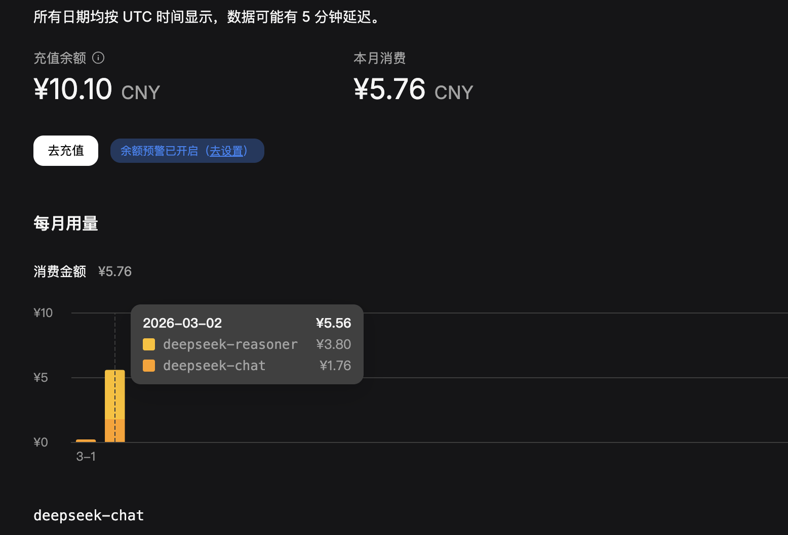

# 启动前
- deepseek-chat: 122次
- 初始花销: 1.42 元

# 第一次启动 / 次 
- 启动时间: 2026-03-02 16:00
- deepseek-chat: 137
- deepseek-reasoner: 62
- 当前花销: 2.48 元
- 花销计算: 2.48 元 - 1.42 元 = 1.06 元
- 任务描述: 完成项目初始化扫描和脚手架搭建

# 第二次启动 / 次 
- 启动时间: 2026-03-02 16:27
- deepseek-chat: 140
- deepseek-reasoner: 106
- 当前花销: 3.29 元
- 花销计算: 3.29 元 - 2.48 元 = 0.81 元
- 任务描述: 完成后端项目初始化

# 第三次启动 / 次 
- 启动时间: 2026-03-02 16:51
- deepseek-chat: 144
- deepseek-reasoner: 233
- 当前花销: 5.56 元
- 花销计算: 5.56 元 - 3.29 元 = 2.27 元
- 任务描述: 完成任务feat-002与feat-003教程内容输入基础实现 

## 0302花销记录

